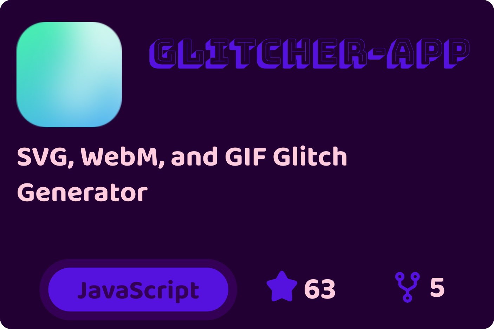
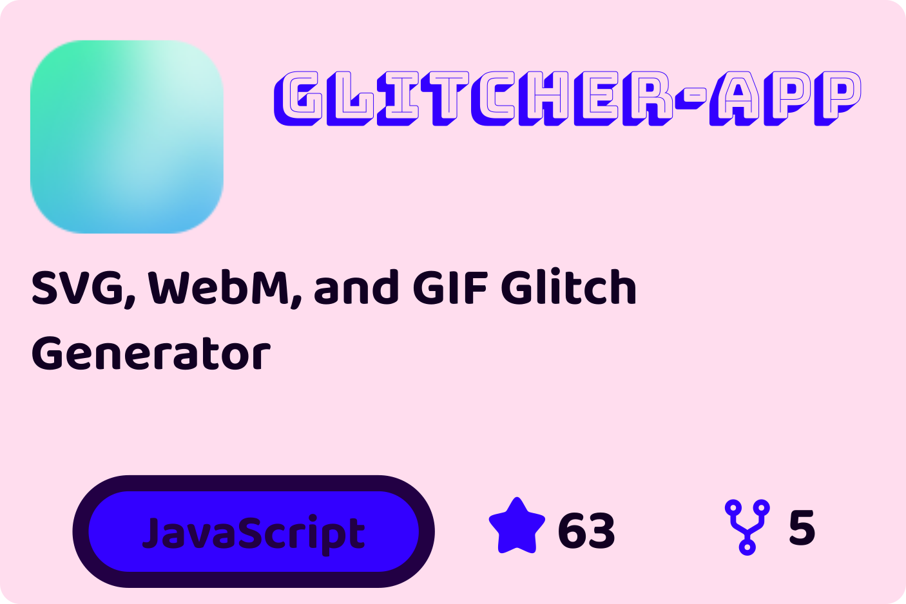
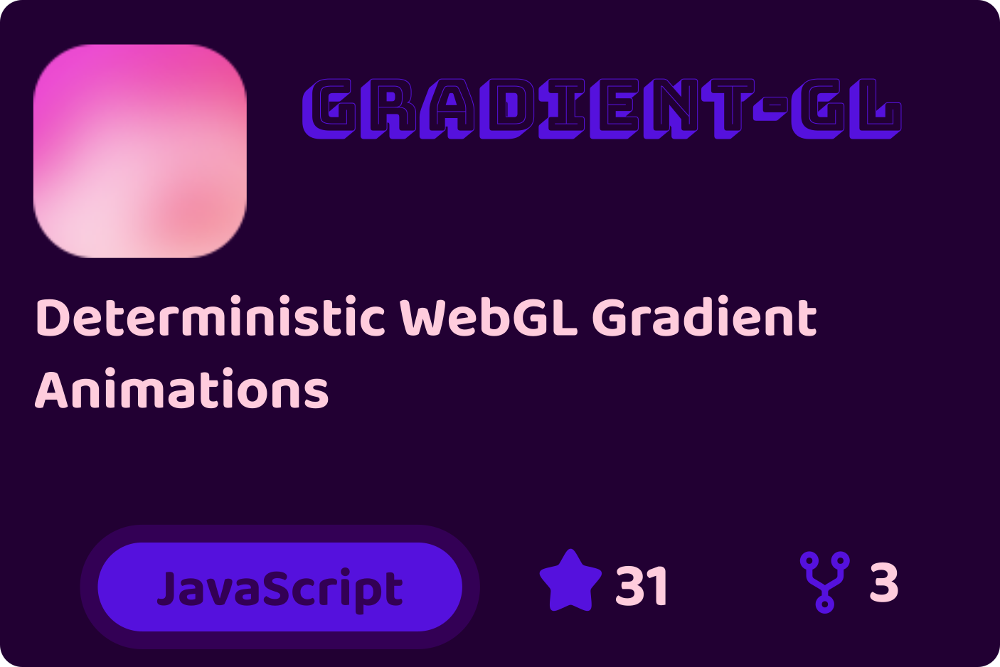
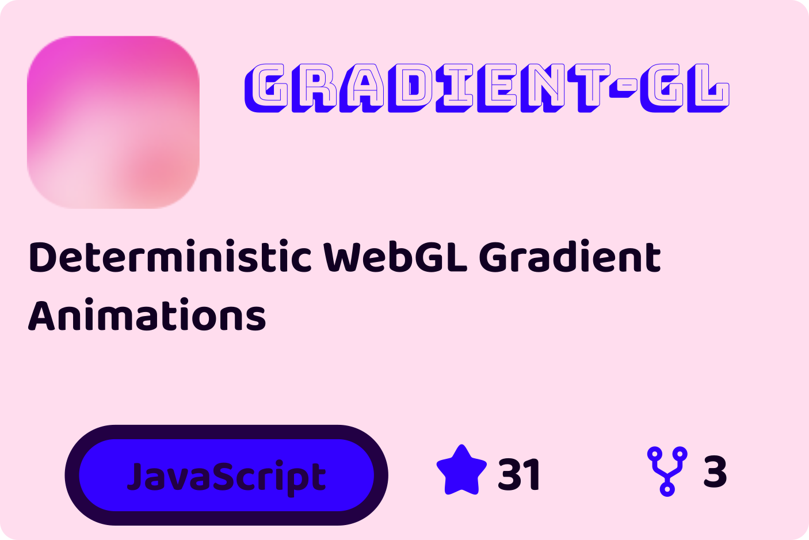

<div align="center">
    <h3>GitHub Repo Cards</h3>
    
    <p>
        GitHub Action
        <br>
         generating sleek · static
        <br>
        repository cards
        <br>
        rasterized · versioned · customizable
    </p>
    
    
    
    
</div>


github-repo-cards is a GitHub Action that renders customizable static cards for your repositories.
Cards are generated fully offline, styled with simple overrides, and committed directly to your repository, no servers, no embeds, no runtime dependencies.

Built for clean READMEs, wikis, blogs, or social previews.
Run it on a schedule or trigger it manually in your GitHub workflow—zero maintenance required.


No runtime. No APIs. No server. No embeds. Cards are generated and committed directly into your repository.

---

> [!CAUTION]
> DO NOT USE
> 🚧 NOT PRODUCTION READY

---

## Table of Contents

- [Overview](#overview)
- [Features](#features)
- [Use Cases](#use-cases)
- [Quick Start](#quick-start)
- [GitHub Actions Usage](#github-actions-usage)
- [Configuration Options](#configuration-options)
- [Customization](#customization)
- [CLI Usage](#cli-usage)
- [Similar Tools](#similar-tools)
- [License](#license)

## Overview

This action generates beautiful, customizable PNG cards for your GitHub repositories that you can use in your profile, documentation, or anywhere else. The primary way to use this tool is through GitHub Actions.

> [!TIP]
> Showcase your repositories with beautiful, customizable cards for READMEs, wikis, blogs, and more—without relying on third-party servers.

The action handles the entire process: generating the cards, committing them, and pushing them to your repository in one seamless workflow.

## Features

- ⚡ **PNG output** at 300 DPI – paste straight into READMEs, wikis, blogs
- 🎨 **Theme-able** via dead-simple `KEY=value` overrides (light/dark aware)
- 🪄 **Zero dependencies** inside the cards – everything rendered to pixels
- 🏃 **One-shot** GitHub Action that commits the result back to the repository
- 🖥 **CLI parity** for local previews or fully-offline usage

> [!TIP]
> Every aspect—colors, fonts, logos, layout—can be customized with a single line.

<details>
<summary>Use Cases</summary>

- Add eye-catching repo cards to your GitHub profile README
- Showcase project stats in documentation or wikis
- Embed cards in personal blogs or websites
- Generate assets for social media or presentations
</details>

## Quick Start

> [!TIP]
> The fastest way to get started is by adding a GitHub workflow file to your repository.

1. Create a `.github/workflows/repo-cards.yml` file in your repository
2. Add the following content:

```yaml
name: Generate Repository Cards
on:
  # Run weekly to keep cards updated automatically
  schedule:
    - cron: '0 0 * * 1'  # Weekly on Mondays
  # Also allow manual execution when needed
  workflow_dispatch:

permissions:
  contents: write  # Needed for pushing changes

jobs:
  generate-cards:
    runs-on: ubuntu-latest
    steps:
      - uses: actions/checkout@v4
      - uses: metaory/github-repo-cards@v1
        with:
          repositories: |
            repo-cards
            dotfiles
          template: default  # Optional, picks SVG layout preset
        env:
          GITHUB_TOKEN: ${{ secrets.GITHUB_TOKEN }}
```

3. Run the workflow manually through the GitHub Actions tab
4. Find your generated cards in the `cards` directory (or custom output location)
5. The action automatically commits and pushes the generated cards to your repository

## GitHub Actions Usage

### Configuration Options

> [!NOTE]
> All parameters can be provided as multi-line strings for better readability in your workflow files.

| Parameter       | Required | Description                                             |
|-----------------|----------|---------------------------------------------------------|
| `repositories`  | Yes      | Newline-separated list of repository names              |
| `overrides`     | No       | Style overrides (colors, sizes, etc.)                   |
| `template`      | No       | SVG template/layout preset (default: `default`)         |
| `output`        | No       | Output directory for generated cards (default: `cards`) |
| `fonts`         | No       | Custom font configurations                              |
| `logo`          | No       | Logo style and options                                  |

<details>
<summary>Advanced GitHub Action Configuration</summary>

> [!IMPORTANT]
> Make sure to set `permissions: contents: write` in your workflow to allow committing generated cards.

```yaml
name: Generate Repository Cards
on:
  workflow_dispatch:
  # Optional: Generate on schedule or on push
  schedule:
    - cron: '0 0 * * 0'  # Weekly on Sundays
  push:
    branches: [ master ]
    paths:
      - '.github/workflows/repo-cards.yml'

permissions:
  contents: write  # Needed for pushing changes

jobs:
  generate-cards:
    runs-on: ubuntu-latest
    steps:
      - uses: actions/checkout@v4

      - uses: metaory/github-repo-cards@v1
        with:
          repositories: |
            repo-cards
            dotfiles
            my-awesome-project
          overrides: |
            DARK_BG=#181825 DARK_FG=#cdd6f4  # Dark mode colors
            RADIUS=14       BORDER=6         # Card shape properties
          fonts: |
            head=https://cdn.jsdelivr.net/fontsource/fonts/inter@latest/latin-400-normal.ttf
            body=https://cdn.jsdelivr.net/fontsource/fonts/inter@latest/latin-400-normal.ttf
            lang=https://cdn.jsdelivr.net/fontsource/fonts/nabla@latest/latin-400-normal.ttf
            stat=https://cdn.jsdelivr.net/fontsource/fonts/monofett@latest/latin-400-normal.ttf
          logo: |
            style=glass
            radius=28
            backgroundType=gradientLinear
          output: assets/cards   # Cards will be generated, committed and pushed to this directory
          template: default  # Optional, picks SVG layout preset
        env:
          GITHUB_TOKEN: ${{ secrets.GITHUB_TOKEN }}
```
</details>

## Customization

<details>
<summary>Style Overrides</summary>

Any variable can be prefixed with `DARK_` or `LIGHT_` to set theme-specific values. If you do not use a prefix, the value will be used for both light and dark themes. This applies to all variables—including those like `LANG_RECT_BORDER_WIDTH` and `LANG_RECT_RADIUS`, which are typically universal, but can be set per theme if you wish.

Simple color and layout adjustments:

```yaml
overrides: |
  CARD_BG=#ffffff             # Card background
  CARD_FG=#000000             # Card text color
  LANG_RECT_BORDER_WIDTH=8    # Language rectangle border width
  LANG_RECT_RADIUS=24         # Language rectangle border radius
  LANG_RECT_OPACITY=1         # Opacity of the language rectangle (0 = transparent, 1 = opaque)
  STAT_ICONS=#FF88EE          # Stat icon color (star, fork)
  HEAD_STROKE=#FF66FF         # Header text stroke color
  HEAD_STROKE_WIDTH=2         # Header text stroke width
```

> [!TIP]
> You can target specific color modes by prefixing variables with `LIGHT_` or `DARK_` for theme-specific styling. If you set both, each theme will use its value; if you set only the unprefixed variable, both themes will use that value. This applies to all variables.

Theme-specific overrides with `LIGHT_` or `DARK_` prefixes:

```yaml
overrides: |
  # Light mode
  LIGHT_CARD_BG=#FFDDEE
  LIGHT_CARD_FG=#110022
  LIGHT_HEAD_FG=#330044
  LIGHT_HEAD_STROKE=$LIGHT_HEAD_FG
  LIGHT_HEAD_STROKE_WIDTH=0
  LIGHT_STAT_FG=$LIGHT_CARD_FG
  LIGHT_STAT_ICONS=$LIGHT_HEAD_FG
  LIGHT_LANG_RECT_OPACITY=0
  LIGHT_LANG_RECT_RADIUS=24
  LIGHT_LANG_RECT_BORDER_WIDTH=8
  LIGHT_LANG_FG=$LIGHT_CARD_FG

  # Dark mode
  DARK_CARD_BG=#220033
  DARK_CARD_FG=#FFCCDD
  DARK_HEAD_FG=$DARK_CARD_FG
  DARK_HEAD_STROKE=$DARK_HEAD_FG
  DARK_HEAD_STROKE_WIDTH=0.4
  DARK_STAT_FG=$DARK_CARD_FG
  DARK_STAT_ICONS=#6611FF
  DARK_LANG_RECT_OPACITY=0
  DARK_LANG_RECT_RADIUS=24
  DARK_LANG_RECT_BORDER_WIDTH=8
  DARK_LANG_FG=$DARK_CARD_FG
```

**Variables:**

Any variable can be prefixed with `DARK_` or `LIGHT_` for theme-specific overrides.

_Color & Theme:_
- `CARD_BG`: Card background color
- `CARD_FG`: Card foreground/text color
- `HEAD_FG`: Header/title color
- `HEAD_STROKE`: Header/title stroke color
- `HEAD_STROKE_WIDTH`: Header/title stroke width
- `STAT_FG`: Stat number color (stars, forks)
- `STAT_ICONS`: Stat icon color (star, fork)
- `LANG_FG`: Language text color
- `LANG_RECT_BG`: Language rectangle background color
- `LANG_RECT_BORDER`: Language rectangle border color
- `LANG_RECT_BORDER_WIDTH`: Language rectangle border thickness
- `LANG_RECT_RADIUS`: Language rectangle border radius
- `LANG_RECT_OPACITY`: Language rectangle opacity (0–1)

_Shape/Other:_
- `RADIUS`: Card border radius
</details>

<details>
<summary>Fonts</summary>

Custom TTF fonts for `head`, `body`, `lang`, and `stat` sections. Default fonts provided but easily overridden:

```yaml
fonts: |
  head=https://cdn.jsdelivr.net/fontsource/fonts/inter@latest/latin-400-normal.ttf
  body=https://cdn.jsdelivr.net/fontsource/fonts/inter@latest/latin-400-normal.ttf
  lang=https://cdn.jsdelivr.net/fontsource/fonts/nabla@latest/latin-400-normal.ttf
  stat=https://cdn.jsdelivr.net/fontsource/fonts/monofett@latest/latin-400-normal.ttf
```

> [!CAUTION]
> Only `.ttf` font format is supported. Using other formats may cause rendering issues.

Format: `section=url-to-ttf`

**Key Points:**
- All sections (`head`, `body`, `lang`, `stat`) support custom fonts
- Font size and weight are locked for layout stability
- Only font family (as a TTF URL) is customizable
- `lang` is used for the language label
- `stat` is used for numeric stats (stars, forks)

**How to Find Fonts:**
1. **Fontsource** (Recommended): Browse [Fontsource](https://fontsource.org/fonts) for fonts
   - Find your desired font and click on it
   - Look for the "CDN Links" section and copy the URL ending with `.ttf`
   - Example URL format: `https://cdn.jsdelivr.net/fontsource/fonts/font-name@latest/latin-400-normal.ttf`
   - Change `400` to your desired weight (if available)

2. **Google Fonts**: Use [Google Fonts](https://fonts.google.com/)
   - Select a font you like
   - Google Fonts can be accessed via Fontsource using the same pattern as above

3. **Direct TTF Files**: You can use any direct URL to a `.ttf` file

**Example: Mix Different Fonts**
```yaml
fonts: |
  head=https://cdn.jsdelivr.net/fontsource/fonts/comic-neue@latest/latin-700-normal.ttf
  body=https://cdn.jsdelivr.net/fontsource/fonts/inter@latest/latin-400-normal.ttf
  lang=https://cdn.jsdelivr.net/fontsource/fonts/inter@latest/latin-600-normal.ttf
  stat=https://cdn.jsdelivr.net/fontsource/fonts/inter@latest/latin-400-normal.ttf
```

**Sources:** [Google Fonts](https://fonts.google.com/) | [Fontsource](https://fontsource.org/) | [Font Library](https://fontlibrary.org/)
</details>

<details>
<summary>Logo Options</summary>

> [!WARNING]
> The `style` parameter is required for logo generation. Without it, logos will not be created.

Set DiceBear avatar style (style parameter is required):

```yaml
logo: |
  style=glass  # Required parameter!
```

More options for the DiceBear-generated avatar:

```yaml
logo: |
  style=glass                     # Required parameter
  radius=28                       # Rounded corners
  backgroundType=gradientLinear   # Background type
```

**Key Parameters:**
- `style`: Avatar style (mandatory)
- `radius`: Corner roundness (0-50)
- `backgroundColor`: Custom background color in hex
- `backgroundType`: Background type (solid or gradientLinear)

**Popular Styles:** adventurer, avataaars, bottts, funEmoji, personas, pixelArt, shapes

[Browse all styles](https://www.dicebear.com/styles/)

<details>
<summary>All DiceBear Core Options</summary>

- `style`: Avatar style name (required)
- `seed`: String to generate consistent avatars
- `flip`: Boolean to flip horizontally
- `rotate`: Degree of rotation (0-360)
- `scale`: Scale percentage (0-200)
</details>
</details>

## CLI Usage

```bash
# Generate cards for all repositories
github-repo-cards --repositories "repo-cards dotfiles" --template default --output cards

# Generate cards for a specific repository
github-repo-cards --repositories "repo-cards" --template default --output cards
```

## Similar Tools

- [Repo Cards](https://github.com/repo-cards/repo-cards)
- [GitHub Profile README](https://github.com/anuraghazra/github-readme-stats)

## License

This project is licensed under the MIT License. See the [LICENSE](LICENSE) file for more details.